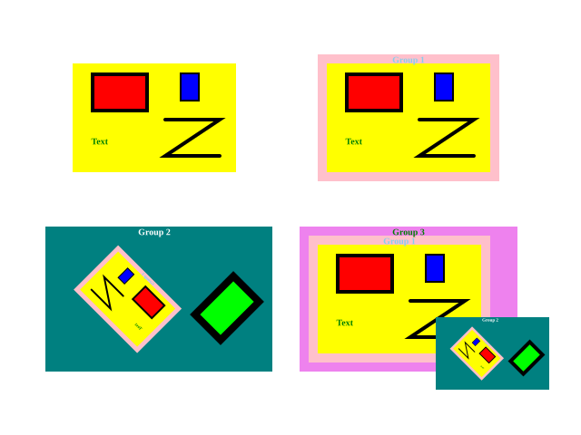

# FabricJS Coordinate System Test

## Fabric Canvas in Canvas Element in HTML

coords.html
```
<!DOCTYPE html>
<html>
  <head>
    <script>
      window.onload = function() {
        const canvas_1 = new fabric.Canvas('canvas_1', { width: 640, height: 480 });
        const canvas_2 = new fabric.Canvas('canvas_2', { width: 320, height: 240 });
        const canvas_2.viewportTransform = [2, 0, 0, 2, 0, 1, 1];
        console.log('body BoundingRect =', window.document.body.getBoundingClientRect());
        console.log('canvas_1 BoundingRect =', canvas_1.getElement().getBoundingClientRect());
        console.log('canvas_1 viewportTransform =', canvas_1.viewportTransform);
        console.log('canvas_2 BoundingRect =', canvas_2.getElement().getBoundingClientRect());
        console.log('canvas_2 viewportTransform =', canvas_2.viewportTransform);
      };
    </script>
  </head>
  <body>
    <canvas id="canvas_1" width="640" height="480"></canvas>
    <canvas id="canvas_2" width="640" height="480"></canvas>
    <script src="https://cdnjs.cloudflare.com/ajax/libs/fabric.js/5.3.1/fabric.min.js"></script>
  </body>
</html>
```

The result is
```
body BoundingRect = DOMRect {
  x: 8, y: 8, width: 406, height: 720,
  left: 8, top: 8, right: 414, bottom: 728,
}
canvas_1 BoundingRect = DOMRect {
  x: 8, y: 8, width: 640, height: 480,
  left: 8, top: 8, right: 648, bottom: 488,
}
canvas_1 viewportTransform = [1, 0, 0, 1, 0, 0]
canvas_2 BoundingRect = DOMRect {
  x: 8, y: 488, width: 320, height: 240,
  left: 8, top: 488, right: 328, bottom: 728,
}
canvas_2 viewportTransform = [2, 0, 0, 2, 1, 1]
```

## Summary of Coords Result

This result is based on FabricJS 5.5.2



### no group

rect1.toJSON()
```
{
  type: "rect",
  left: 100,
  top: 80,
  width: 60,
  height: 40,
  strokeWidth: 4,
}
```

rect1.getBoundingRect()
```
  left: 100,
  top: 80,
  width: 64,
  height: 44,
```

rect2.toJSON()
```
{
  type: "rect",
  left: 220,
  top: 80,
  width: 60,
  height: 40,
  strokeWidth: 4,
}
```

rect2.getBoundingRect()
```
  left: 198,
  top: 80,
  width: 22,
  height: 32,
```

text3.toJSON()
```
{
  type: "text",
  left: 100,
  top: 150,
  width: 18.5205078125,
  height: 11.299999999999999,
  strokeWidth: 1,
}
```

text3.getBoundingRect()
```
{
  left: 100,
  top: 150,
  width: 19.5205078125,
  height: 12.300000000000011,
}
```

line4.toJSON()
```
{
  type: "polyline",
  left: 180,
  top: 130,
  width: 60,
  height: 40,
  strokeWidth: 4,
  points: [
    { x: 0, y: 0 },
    { x: 60, y: 0 },
    { x: 0, y: 40 },
    { x: 60, y: 40 },
  ],
}
```

line4.getBoundingRect()
```
{
  left: 180,
  top: 130,
  width: 64,
  height: 44,
}
```

### group 1

group1.toJSON()
```
{
  type: "group",
  left: 350,
  top: 60,
  width: 200,
  height: 140,
  strokeWidth: 0,
  centerPoint: { x: 450, y: 130 },
}

group1.getBoundingRect()
```
{
  left: 350,
  top: 60,
  width: 200,
  height: 140,
}
```

(rect1 in no group).toJSON()
```
  type: "rect",
  left: -70,
  top: -50,
  width: 60,
  height: 40,
  strokeWidth: 4
```

(rect1 in no group).getBoundingRect()
```
{
  left: 380,
  top: 80,
  width: 64,
  height: 44,
}
```

(rect2 in no group).toJSON()
```
{
  type: "rect",
  left: 50,
  top: -50,
  width: 60,
  height: 40,
  strokeWidth: 4,
}
```

(rect2 in no group).getBoundingRect()
```
  left: 478,
  top: 80,
  width: 22,
  height: 32,
```

(text3 in no group).toJSON()
```
{
  type: "text",
  left: -70,
  top: 20,
  width: 18.5205078125,
  height: 11.299999999999999,
  strokeWidth: 1,
}
```

(text3 in no group)getBoundingRect()
```
{
  left: 380,
  top: 150,
  width: 19.5205078125,
  height: 12.299999999999997,
}
```

(line4 in no group).toJSON()
```
{
  type: "polyline",
  left: 10,
  top: 0,
  width: 60,
  height: 40,
  strokeWidth: 4,
  points: [
    { x: 0, y: 0 },
    { x: 60, y: 0 },
    { x: 0, y: 40 },
    { x: 60, y: 40 },
  ],
}
```

(line4 in no group).getBoundingRect()
```
{
  left: 460,
  top: 130,
  width: 64,
  height: 44,
}
```

### group 2

group2.toJSON()
```
{
  type: "group",
  left: 50,
  top: 250,
  width: 250,
  height: 160,
  strokeWidth: 0,
  centerPoint: { x: 175, y: 300 },
}
```

group2.getBoundingRect()
```
{
  left: 50,
  top: 250,
  width: 250,
  height: 160,
}
```

(no group).toJSON()
```
{
  type: "group",
  left: -45,
  top: -60,
  width: 200,
  height: 140,
  strokeWidth: 0,
  centerPoint: { x: -34.39339828220179, y: 0.10407640085653469 },
}
```

(no group).getBoundingRect()
```
{
  left: 80.50252531694167,
  top: 270,
  width: 120.20815280171308,
  height: 120.20815280171307,
}
```

rect2.toJSON()
```
{
  type: "rect",
  originX: "center",
  originY: "center",
  left: 75,
  top: 10,
  width: 20,
  height: 30,
  strokeWidth: 4,
}
```

rect2.getBoundingRect()
```
{
  left: 208.98780669118025,
  top: 298.98780669118025,
  width: 82.02438661763952,
  height: 82.02438661763952,
}
```

### group 3

group3.toJSON()
```
{
  type: "group",
  left: 300,
  top: 250,
  width: 275,
  height: 180,
  strokeWidth: 0,
  centerPoint: { x: 467.5, y: 340 },
}
```

group3.getBoundingRect()
```
{
  left: 330,
  top: 250,
  width: 275,
  height: 180,
}
```

(group1).toJSON()
```
{
  type: "group",
  left: -127.5,
  top: -80,
  width: 200,
  height: 140,
  strokeWidth: 0,
  centerPoint: { x: -27.5, y: -10 },
}
```

(group1).getBoundingRect()
```
{
  left: 340,
  top: 260,
  width: 200,
  height: 140,
}
```

(group2).toJSON()
```
{
  type: "group",
  left: 12.5,
  top: 10,
  width: 250,
  height: 160,
  strokeWidth: 0,
  centerPoint: { x: 75, y: 50 },
}
```

(group2).getBoundingRect()
```
{
  left: 480,
  top: 350,
  width: 125,
  height: 80,
}
```
