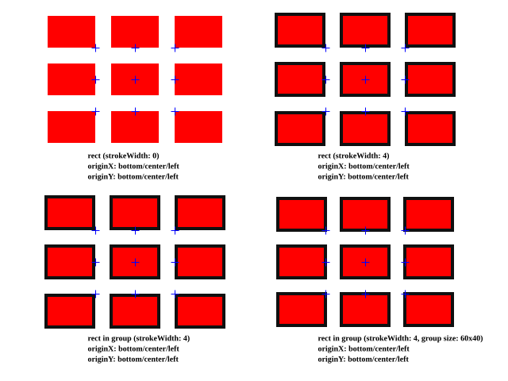

# FabricJS Coordinate System Test

## Summary of Origin Result 

This result is based on FabricJS 5.5.2



### rect (strokeWidth: 0)

The `left` and `top` values might look strange at first glance. This is because these values represent the position of the object's origin point, not necessarily the top-left corner of the object.

In FabricJS, each object has an origin point defined by `originX` and `originY` properties. These properties determine which point of the object is positioned at the specified `left` and `top` coordinates:

- When `originX: "left"`, the `left` value refers to the left edge of the object
- When `originX: "center"`, the `left` value refers to the horizontal center of the object
- When `originX: "right"`, the `left` value refers to the right edge of the object

Similarly for the vertical positioning:
- When `originY: "top"`, the `top` value refers to the top edge of the object
- When `originY: "center"`, the `top` value refers to the vertical center of the object
- When `originY: "bottom"`, the `top` value refers to the bottom edge of the object

This is why the same `left` and `top` values can result in different visual positions depending on the origin settings. The bounding rectangle calculations always return the absolute position of the object's edges, regardless of the origin settings.

rects.toJSON()
```
{ originX: "right" , originY: "bottom", left: 120, top:  60, width: 60, height: 40, strokeWidth: 0 }
{ originX: "center", originY: "bottom", left: 170, top:  60, width: 60, height: 40, strokeWidth: 0 }
{ originX: "left"  , originY: "bottom", left: 220, top:  60, width: 60, height: 40, strokeWidth: 0 }
{ originX: "right" , originY: "center", left: 120, top: 100, width: 60, height: 40, strokeWidth: 0 }
{ originX: "center", originY: "center", left: 170, top: 100, width: 60, height: 40, strokeWidth: 0 }
{ originX: "left"  , originY: "center", left: 220, top: 100, width: 60, height: 40, strokeWidth: 0 }
{ originX: "right" , originY: "top"   , left: 120, top: 140, width: 60, height: 40, strokeWidth: 0 }
{ originX: "center", originY: "top"   , left: 170, top: 140, width: 60, height: 40, strokeWidth: 0 }
{ originX: "left"  , originY: "top"   , left: 220, top: 140, width: 60, height: 40, strokeWidth: 0 }
```

rects.getBoundingRect()
```
{ left:  60, top:  20, width: 60, height: 40 }
{ left: 140, top:  20, width: 60, height: 40 }
{ left: 220, top:  20, width: 60, height: 40 }
{ left:  60, top:  80, width: 60, height: 40 }
{ left: 140, top:  80, width: 60, height: 40 }
{ left: 220, top:  80, width: 60, height: 40 }
{ left:  60, top: 140, width: 60, height: 40 }
{ left: 140, top: 140, width: 60, height: 40 }
{ left: 220, top: 140, width: 60, height: 40 }
```

### rect (strokeWidth: 4)

rects.toJSON()
```
{ originX: "right" , originY: "bottom", left: 410, top:  60, width: 60, height: 40, strokeWidth: 4 }
{ originX: "center", originY: "bottom", left: 460, top:  60, width: 60, height: 40, strokeWidth: 4 }
{ originX: "left"  , originY: "bottom", left: 510, top:  60, width: 60, height: 40, strokeWidth: 4 }
{ originX: "right" , originY: "center", left: 410, top: 100, width: 60, height: 40, strokeWidth: 4 }
{ originX: "center", originY: "center", left: 460, top: 100, width: 60, height: 40, strokeWidth: 4 }
{ originX: "left"  , originY: "center", left: 510, top: 100, width: 60, height: 40, strokeWidth: 4 }
{ originX: "right" , originY: "top"   , left: 410, top: 140, width: 60, height: 40, strokeWidth: 4 }
{ originX: "center", originY: "top"   , left: 460, top: 140, width: 60, height: 40, strokeWidth: 4 }
{ originX: "left"  , originY: "top"   , left: 510, top: 140, width: 60, height: 40, strokeWidth: 4 }
```

rects.getBoundingRect()
```
{ left: 346, top:  16, width: 64, height: 44 }
{ left: 428, top:  16, width: 64, height: 44 }
{ left: 510, top:  16, width: 64, height: 44 }
{ left: 346, top:  78, width: 64, height: 44 }
{ left: 428, top:  78, width: 64, height: 44 }
{ left: 510, top:  78, width: 64, height: 44 }
{ left: 346, top: 140, width: 64, height: 44 }
{ left: 428, top: 140, width: 64, height: 44 }
{ left: 510, top: 140, width: 64, height: 44 }
```

### rect in group (strokeWidth: 4)

groups.toJSON()
```
{ originX: "right" , originY: "bottom", left: 120, top: 290, width: 64, height: 44, objects: [...] }
{ originX: "center", originY: "bottom", left: 170, top: 290, width: 64, height: 44, objects: [...] }
{ originX: "left"  , originY: "bottom", left: 220, top: 290, width: 64, height: 44, objects: [...] }
{ originX: "right" , originY: "center", left: 120, top: 330, width: 64, height: 44, objects: [...] }
{ originX: "center", originY: "center", left: 170, top: 330, width: 64, height: 44, objects: [...] }
{ originX: "left"  , originY: "center", left: 220, top: 330, width: 64, height: 44, objects: [...] }
{ originX: "right" , originY: "top"   , left: 120, top: 370, width: 64, height: 44, objects: [...] }
{ originX: "center", originY: "top"   , left: 170, top: 370, width: 64, height: 44, objects: [...] }
{ originX: "left"  , originY: "top"   , left: 220, top: 370, width: 64, height: 44, objects: [...] }
```

groups.getBoundingRect()
```
{ left:  56, top: 246, width: 64, height: 44 }
{ left: 138, top: 246, width: 64, height: 44 }
{ left: 220, top: 246, width: 64, height: 44 }
{ left:  56, top: 308, width: 64, height: 44 }
{ left: 138, top: 308, width: 64, height: 44 }
{ left: 220, top: 308, width: 64, height: 44 }
{ left:  56, top: 370, width: 64, height: 44 }
{ left: 138, top: 370, width: 64, height: 44 }
{ left: 220, top: 370, width: 64, height: 44 }
```

rects.getBoundingRect()
```
{ left: -32, top: -22, width: 64, height: 44 }
...
```

### rect in group (group size: 60x40, strokeWidth: 4)

groups.toJSON()
```
{ originX: "right" , originY: "bottom", left: 410, top: 290, width: 60, height: 40, objects: [...] }
{ originX: "center", originY: "bottom", left: 460, top: 290, width: 60, height: 40, objects: [...] }
{ originX: "left"  , originY: "bottom", left: 510, top: 290, width: 60, height: 40, objects: [...] }
{ originX: "right" , originY: "center", left: 410, top: 330, width: 60, height: 40, objects: [...] }
{ originX: "center", originY: "center", left: 460, top: 330, width: 60, height: 40, objects: [...] }
{ originX: "left"  , originY: "center", left: 510, top: 330, width: 60, height: 40, objects: [...] }
{ originX: "right" , originY: "top"   , left: 410, top: 370, width: 60, height: 40, objects: [...] }
{ originX: "center", originY: "top"   , left: 460, top: 370, width: 60, height: 40, objects: [...] }
{ originX: "left"  , originY: "top"   , left: 510, top: 370, width: 60, height: 40, objects: [...] }
```

groups.getBoundingRect()
```
{ left: 350, top: 250, width: 60, height: 40 }
{ left: 430, top: 250, width: 60, height: 40 }
{ left: 510, top: 250, width: 60, height: 40 }
{ left: 350, top: 310, width: 60, height: 40 }
{ left: 430, top: 310, width: 60, height: 40 }
{ left: 510, top: 310, width: 60, height: 40 }
{ left: 350, top: 370, width: 60, height: 40 }
{ left: 430, top: 370, width: 60, height: 40 }
{ left: 510, top: 370, width: 60, height: 40 }
```

rects.getBoundingRect()
```
{ left: -32, top: -22, width: 64, height: 44 }
...
```
