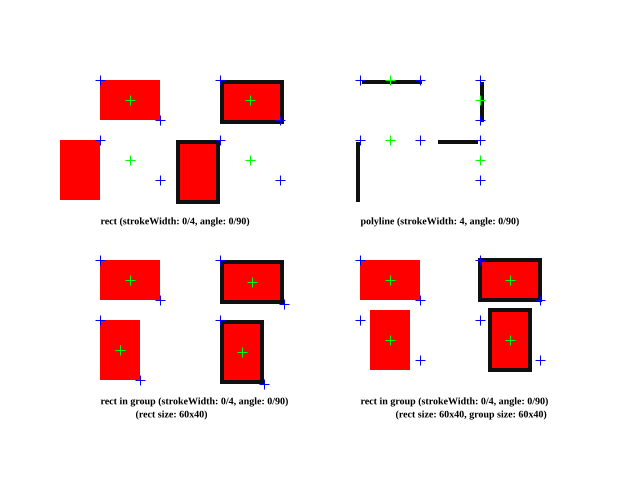

# FabricJS Coordinate System Test

## Summary of Stroke Result 

This result is based on FabricJS 5.5.2



### rect (strokeWidth: 0)

rect.toJSON()
```
{
  type: "rect",
  left: 100,
  top: 80,
  width: 60,
  height: 40,
  stroke: "#101010",
  strokeWidth: 0,
}
```

rect.getBoundingRect()
```
{ left: 100, top: 80, width: 60, height: 40 }
```

### rect (strokeWidth: 0, angle: 90)

rect.toJSON()
```
{
  type: "rect",
  left: 100,
  top: 140,
  width: 60,
  height: 40,
  stroke: "#101010",
  strokeWidth: 0,
  angle: 90,
}
```

rect.getBoundingRect()
```
{ left: 60, top: 140, width: 40, height: 60 }
```

### rect (strokeWidth: 4)

rect.toJSON()
```
{
  type: "rect",
  left: 220,
  top: 80,
  width: 60,
  height: 40,
  stroke: "#101010",
  strokeWidth: 4,
}
```

rect.getBoundingRect()
```
{ left: 220, top: 80, width: 64, height: 44 }
```

### rect (strokeWidth: 4, angle: 90)

rect.toJSON()
```
{
  type: "rect",
  left: 220,
  top: 140,
  width: 60,
  height: 40,
  stroke: "#101010",
  strokeWidth: 4,
  angle: 90,
}
```

rect.getBoundingRect()
```
{ left: 176, top: 140, width: 44, height: 64 }
```

### polyline horizontal (strokeWidth: 4)

When working with polylines in FabricJS, it's important to understand how strokes are rendered. For polylines, the stroke is drawn centered on the path, but with a specific behavior:

- For horizontal lines: The stroke extends equally on both sides of the path horizontally, but extends only downward vertically from the path.
- For vertical lines: The stroke extends equally on both sides of the path vertically, but extends only to the right horizontally from the path.

This behavior explains why a horizontal polyline with a stroke width of 4 has a height of 4 in its bounding rectangle, with the stroke appearing below the defined path. Similarly, a vertical polyline with a stroke width of 4 has a width of 4 in its bounding rectangle, with the stroke appearing to the right of the defined path.

This asymmetric rendering of strokes is an important consideration when positioning polylines precisely within a canvas or when calculating their actual visual boundaries.

polyline.toJSON()
```
{
  type: "polyline",
  left: 360,
  top: 80,
  width: 60,
  height: 0,
  stroke: "#101010",
  strokeWidth: 4,
  points: [{x: 0, y: 0}, {x: 60, y: 0}],
}
```

polyline.getBoundingRect()
```
{ left: 360, top: 80, width: 64, height: 4 }
```

### polyline vertical (strokeWidth: 4)

```
{
  type: "polyline",
  left: 480,
  top: 80,
  width: 0,
  height: 40,
  stroke: "#101010",
  strokeWidth: 4,
  points: [{x: 0, y: 0}, {x: 0, y: 40}],
}
```

polyline.getBoundingRect()
```
{ left: 480, top: 80, width: 4, height: 44 }
```

### rect in group (strokeWidth: 0)

group.toJSON()
```
{
  type: "group",
  left: 100,
  top: 260,
  width: 60,   // updated internally
  height: 40,  // updated internally
  objects: [
    {
      type: "rect",
      left: -30,   // updated internally
      top: -20,    // updated internally
      width: 60,
      height: 40,
      fill: "#FF0000",
      stroke: "#101010",
      strokeWidth: 0,
    },
  ],
}
```

group.getBoundingRect()
```
{ left: 100, top: 260, width: 60, height: 40 }
```

rect.getBoundingRect()
```
{ left: -30, top: -20, width: 60, height: 40 }
```

### rect in group (strokeWidth: 4)

When a rect is placed inside a group, the group's width and height are calculated based on the bounding box of all objects within the group. The position of the rect inside the group is then recalculated relative to the group's center point.

For example, in the case below with a rect that has strokeWidth: 4, the group's dimensions (width: 64, height: 44) are calculated to encompass the entire rect including its stroke. The rect's position (left: -32, top: -22) is set relative to the group's center point, ensuring proper positioning within the group.

group.toJSON()
```
{
  type: "group",
  left: 220,
  top: 260,
  width: 64,   // updated internally
  height: 44,  // updated internally
  objects: [
    {
      type: "rect",
      left: -32,   // updated internally
      top: -22,    // updated internally
      width: 60,
      height: 40,
      fill: "#FF0000",
      stroke: "#101010",
      strokeWidth: 4,
    },
  ],
}
```

group.getBoundingRect()
```
{ left: 220, top: 260, width: 64, height: 44 }
```

group.getCenterPoint()
```
Point { x: 252, y: 282 }
```

rect.getBoundingRect()
```
{ left: -32, top: -22, width: 64, height: 44 }
```

### rect in group (group size: 60x40, strokeWidth: 0)

group.toJSON()
```
{
  type: "group",
  left: 360,
  top: 260,
  width: 60,
  height: 40,
  objects: [
    {
      type: "rect",
      left: -30,   // updated internally
      top: -20,    // updated internally
      width: 60,
      height: 40,
      fill: "#FF0000",
      stroke: "#101010",
      strokeWidth: 0,
    },
  ],
}
```

group.getBoundingRect()
```
{ left: 360, top: 260, width: 60, height: 40 }
```

rect.getBoundingRect()
```
{ left: -30, top: -20, width: 60, height: 40 }
```

### rect in group (group size: 60x40, strokeWidth: 4)

When setting a fixed width and height for a group, if the actual size of a rect (including its stroke) is larger than the group's dimensions, the rect's edges will extend beyond the group's boundaries. This happens because the rect's position is recalculated relative to the group's center point.

For example, in the case below with a rect that has strokeWidth: 4, the rect's actual dimensions (width: 64, height: 44 including stroke) exceed the group's set dimensions (width: 60, height: 40). The rect's position (left: -32, top: -22) is calculated from the group's center point, causing the rect's edges to visibly extend outside the group's boundaries.

group.toJSON()
```
{
  type: "group",
  left: 480,
  top: 260,
  width: 60,
  height: 40,
  objects: [
    {
      type: "rect",
      left: -32,   // updated internally
      top: -22,    // updated internally
      width: 60,
      height: 40,
      fill: "#FF0000",
      stroke: "#101010",
      strokeWidth: 4,
    },
  ],
}
```

group.getBoundingRect()
```
{ left: 480, top: 260, width: 60, height: 40 }
```

group.getCenterPoint()
```
Point { x: 510, y: 280 }
```

rect.getBoundingRect()
```
{ left: -32, top: -22, width: 64, height: 44 }
```
